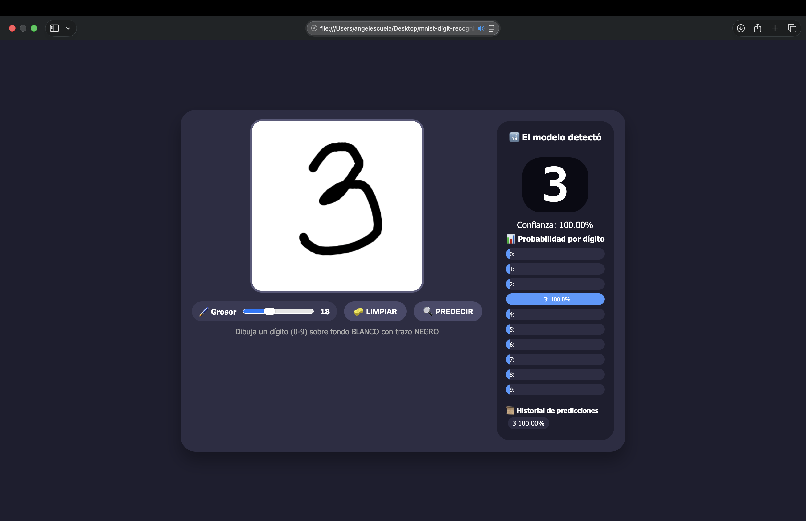
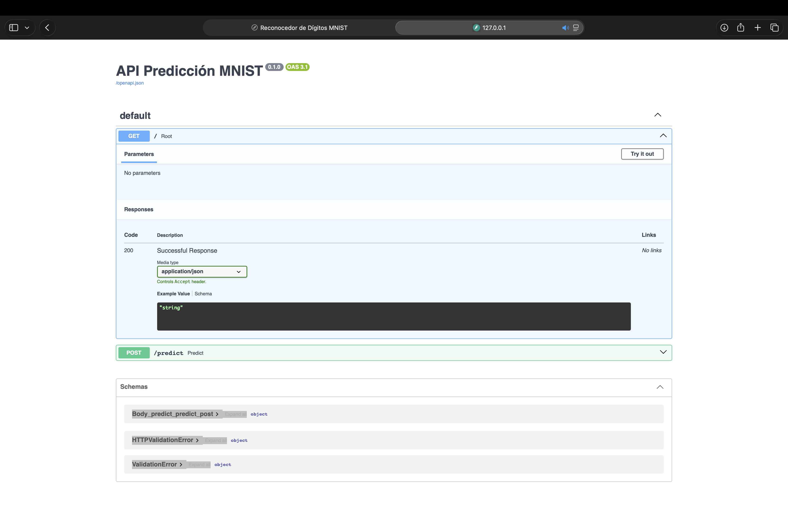
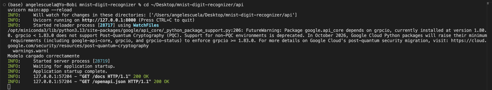

# MNIST Digit Recognizer - Clasificador de Dígitos con IA

[](https://www.python.org/)
[](https://www.tensorflow.org/)
[](https://fastapi.tiangolo.com/)
[](https://www.docker.com/)
[](https://opensource.org/licenses/MIT)

Sistema full-stack de reconocimiento de dígitos manuscritos. El usuario dibuja un número del 0 al 9 en un canvas del navegador y una red neuronal entrenada con el dataset MNIST lo clasifica en tiempo real.

Combina un backend de inferencia con FastAPI y TensorFlow, un contenedor Docker con emulación AMD64 para compatibilidad con Apple Silicon, y un frontend interactivo con canvas HTML5.

---

## Tabla de contenidos

- [Contexto](#contexto)
- [Qué resuelve](#qué-resuelve)
- [Capturas](#capturas)
- [Arquitectura](#arquitectura)
- [Stack tecnológico](#stack-tecnológico)
- [Estructura del proyecto](#estructura-del-proyecto)
- [Instalación y uso](#instalación-y-uso)
- [Endpoints de la API](#endpoints-de-la-api)
- [Preprocesamiento de imagen](#preprocesamiento-de-imagen)
- [Mi rol](#mi-rol)
- [Documentación adicional](#documentación-adicional)
- [Licencia](#licencia)

---

## Contexto

MNIST es un dataset clásico de dígitos manuscritos (60,000 imágenes de entrenamiento, 10,000 de prueba) usado como referencia en visión por computadora. Este proyecto lo lleva a un caso de uso real: una aplicación web donde el usuario dibuja un dígito y ve la predicción del modelo en vivo, con las probabilidades para los 10 dígitos.

Desarrollado como parte de la formación en Ingeniería en Sistemas Computacionales, con foco en integración de modelos de IA a aplicaciones web y buenas prácticas de despliegue con Docker.

---

## Qué resuelve

| Reto | Solución implementada |
|---|---|
| Llevar un modelo Keras a producción web | API REST con FastAPI que carga el modelo una sola vez al arrancar |
| Dibujos hechos a mano vs dataset original | Pipeline de preprocesamiento: umbralización, bounding box, padding, cuadrado, resize LANCZOS |
| Compatibilidad con Mac M3 (Apple Silicon) | Docker con plataforma `linux/amd64` explícita y `tensorflow-cpu` dentro del contenedor |
| Interacción fluida con el usuario | Canvas HTML5 con predicción automática a los 800 ms de soltar el lápiz |

---

## Capturas

### Frontend con canvas interactivo

El usuario dibuja un dígito y la predicción aparece automáticamente a los 800 ms.



### Documentación interactiva de la API (Swagger UI)



### API corriendo con Uvicorn



---

## Arquitectura

```
[ Navegador / Frontend HTML ]
       |
       | fetch POST /predict (imagen PNG)
       v
[ Docker Puerto 8000:8000 ]
       |
       v
[ FastAPI + Uvicorn (main.py) ]
       |
       | preprocesamiento de imagen
       v
[ Modelo Keras (modelo_mnist.keras) ]
       |
       | 10 probabilidades
       v
[ JSON Response -> Frontend ]
```

---

## Stack tecnológico

| Componente | Tecnología |
|---|---|
| Lenguaje | Python 3.12 |
| Modelo IA | TensorFlow / Keras 2.20 |
| API | FastAPI 0.115 + Uvicorn |
| Contenedor | Docker con plataforma `linux/amd64` |
| Frontend | HTML5 + JavaScript + Canvas API |
| Gestión de versiones Python | pyenv |

---

## Estructura del proyecto

```
mnist-digit-recognizer/
├── api/
│   ├── Dockerfile
│   ├── main.py                    # API FastAPI
│   ├── requirements.txt
│   └── model/
│       └── modelo_mnist.keras     # Modelo entrenado
├── frontend/
│   └── index.html                 # Canvas interactivo
├── docs/
│   └── documentacion-tecnica.md
└── capturas/
```

---

## Instalación y uso

### Requisitos

- Python 3.12.13 (instalado con `pyenv`)
- Docker Desktop (opcional, para la variante con contenedor)

Si usas `pyenv`, la versión queda fijada por el archivo `.python-version` del repositorio.

### Opción A - Correr local con Uvicorn

1. Clonar el repositorio

   ```bash
   git clone https://github.com/AngelCanelaaa/mnist-digit-recognizer.git
   cd mnist-digit-recognizer
   ```

2. Crear y activar entorno virtual

   ```bash
   python -m venv venv
   source venv/bin/activate
   ```

3. Instalar dependencias

   ```bash
   pip install -r api/requirements.txt
   ```

4. Levantar la API

   ```bash
   cd api
   uvicorn main:app --reload
   ```

5. Abrir el frontend

   Abre `frontend/index.html` en el navegador. La API debe estar corriendo en `http://localhost:8000`.

### Opción B - Correr con Docker (Mac M3)

```bash
cd api
docker buildx build --platform linux/amd64 -t img-api-mnist .
docker run -d --name srv-api-mnist -p 8000:8000 img-api-mnist:latest
```

Verificar que corre:

```bash
docker ps
```

Abrir `http://localhost:8000` en el navegador.

---

## Endpoints de la API

| Método | Endpoint | Descripción |
|---|---|---|
| GET | `/` | Health check con info del modelo y clases disponibles |
| POST | `/predict` | Recibe imagen PNG, devuelve la clase predicha y probabilidades |

Ejemplo de respuesta de `/predict`:

```json
{
  "clase": "7",
  "probabilidad": 0.9987,
  "todas": {
    "0": 0.0001,
    "1": 0.0002,
    "2": 0.0001,
    "3": 0.0003,
    "4": 0.0001,
    "5": 0.0002,
    "6": 0.0001,
    "7": 0.9987,
    "8": 0.0001,
    "9": 0.0001
  }
}
```

---

## Preprocesamiento de imagen

El modelo se entrenó con imágenes MNIST de 28x28 px, fondo negro y trazo blanco. El canvas del frontend es de 360x360 px con fondo blanco y trazo negro. Para que las predicciones sean precisas, la API aplica este pipeline:

1. **Conversión a escala de grises** de la imagen recibida.
2. **Redimensionar a 28x28** con filtro LANCZOS.
3. **Normalización** al rango [0, 1].
4. **Inversión de colores** para que coincida con el formato MNIST.

---

## Mi rol

Proyecto individual desarrollado como parte de la formación en Ingeniería en Sistemas Computacionales.

Responsabilidades:

- Diseño de la arquitectura full-stack (frontend, API, contenedor).
- Desarrollo del frontend con canvas interactivo y predicción en tiempo real.
- Desarrollo del backend con FastAPI y carga optimizada del modelo Keras.
- Implementación del pipeline de preprocesamiento de imagen.
- Configuración del Dockerfile para compatibilidad con Mac M3 (Apple Silicon).
- Redacción de la documentación técnica completa.

---

## Documentación adicional

- [Documentación técnica](docs/documentacion-tecnica.md) - proceso completo de implementación paso a paso.

---

## Licencia

MIT - ver [LICENSE](LICENSE).

---

**Autor:** Angel de Jesús Canela Figueroa
**Institución:** Instituto Tecnológico de Jiquilpan (TecNM)
**Programa:** Ingeniería en Sistemas Computacionales
